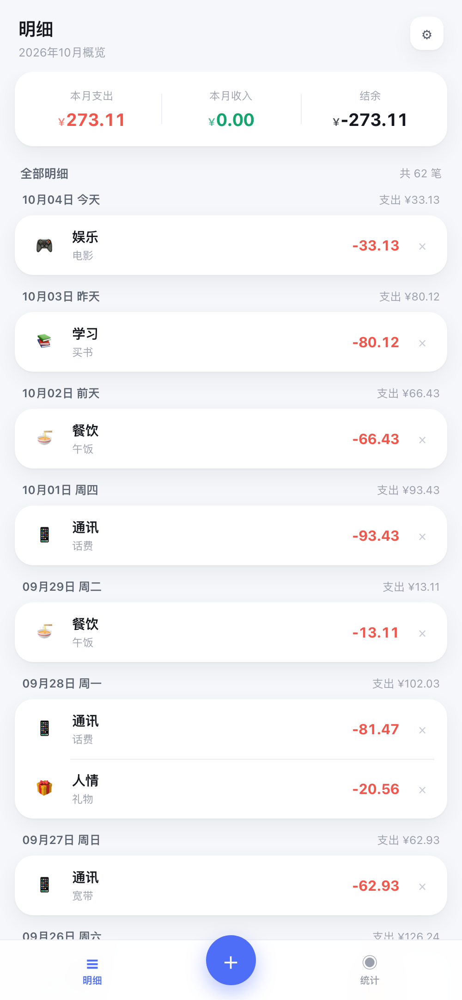
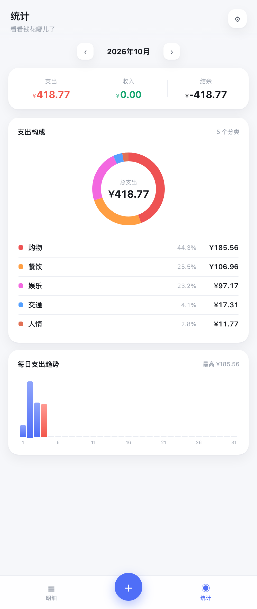

# 极简记账

一个**单文件、零依赖**的记账 Web 应用。双击 `index.html` 就能用，不需要装任何东西、不需要联网、不需要后端。

数据全部保存在浏览器本地（localStorage），不上传任何服务器。

<p align="center">
  
  
</p>

## 特性

**记一笔**
- 内置数字键盘，输入金额 → 选分类 → 保存，三步完事
- 支出 / 收入双类型，共 15 个分类（支出 10 类、收入 5 类），每类独立配色
- 支持备注、日期快选（今天 / 昨天 / 前天）或自选日期
- 保存后金额自动清空，方便连续记账

**明细**
- 按日期分组，显示每日支出小计
- 点击任意一条进入编辑，右侧 `×` 删除
- 顶部常驻本月支出 / 收入 / 结余

**统计**
- 月份可左右切换
- 甜甜圈图看分类占比（含金额与百分比）
- 每日支出趋势柱状图，当天以红色高亮

**数据**
- 全部存 localStorage，纯本地
- 一键导出 CSV（带 BOM，Excel 直接打开不乱码）
- 内置示例数据生成器，可先看满数据效果
- 一键清空

**键盘支持**（桌面端）
- `0-9` `.` 输入金额
- `Backspace` 退格
- `Enter` 保存
- `Esc` 取消编辑

## 使用

```bash
git clone <本仓库地址>
cd <仓库目录>
open index.html          # macOS
# 或者直接双击 index.html
```

也可以把 `index.html` 单独拷走，它不依赖同目录的任何其他文件。

手机上用：把 `index.html` 传到手机，用浏览器打开；或者放到任意静态托管（GitHub Pages / Vercel / 对象存储）后访问链接。

## 数据安全

数据存在**浏览器本地**，意味着：

- ✅ 不联网、不上传，隐私无忧
- ⚠️ 换浏览器、换设备、清理浏览器数据 → 数据会丢

所以重要数据请定期用 **设置 → 导出 CSV** 备份。

## 技术说明

- 纯 HTML + CSS + 原生 JavaScript，**无任何外部依赖**（无 CDN、无构建步骤）
- 图表用 SVG 和 flex 手写，不引第三方图表库
- 单文件约 40 KB
- 响应式，320px 手机到桌面宽屏都做了适配

## 已知限制

- 不支持跨设备同步（本地存储的固有限制）
- 不支持导入 CSV（只能导出）
- 无预算提醒、无自定义分类

## 许可

[MIT](LICENSE)
